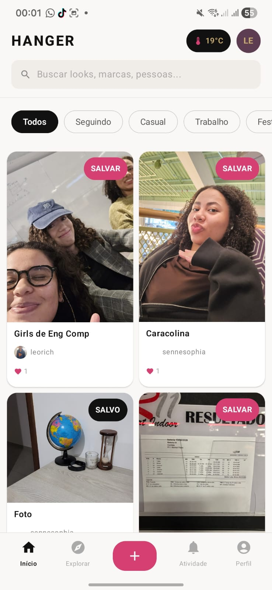
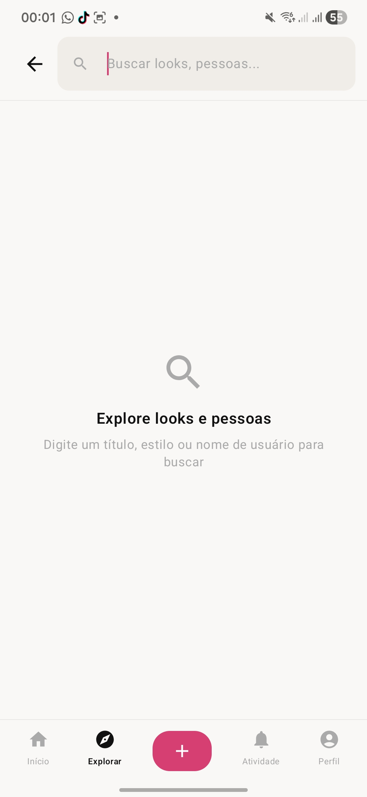
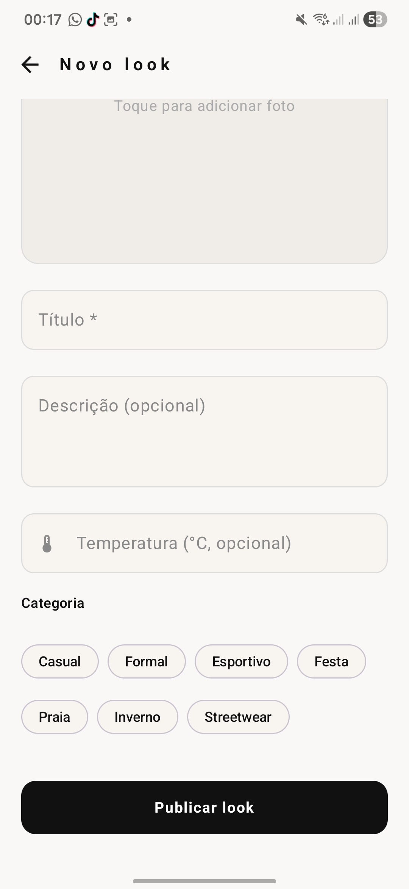
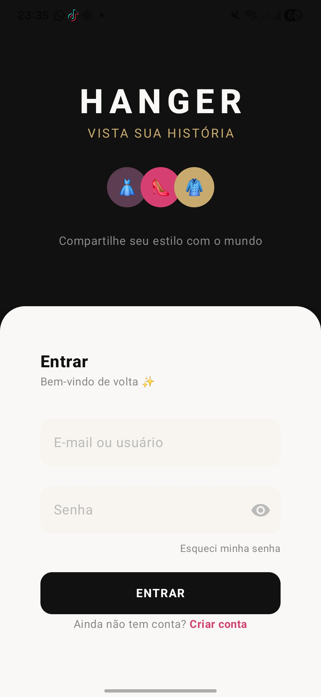
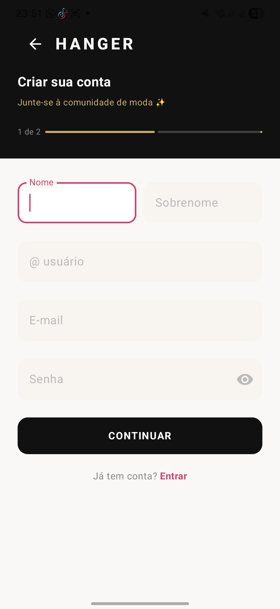
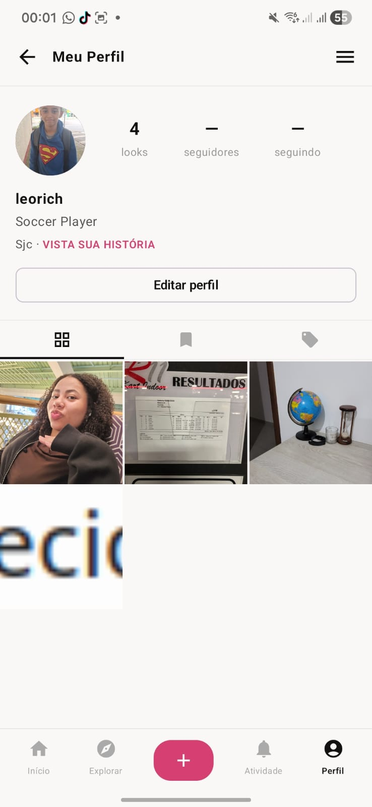
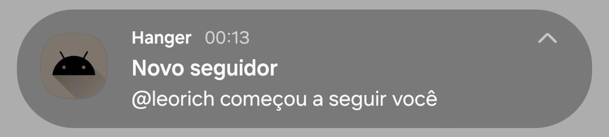
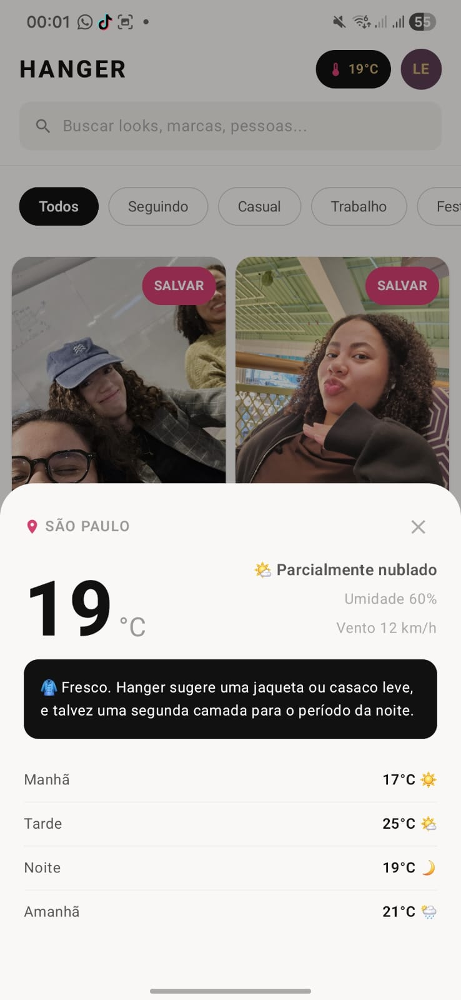
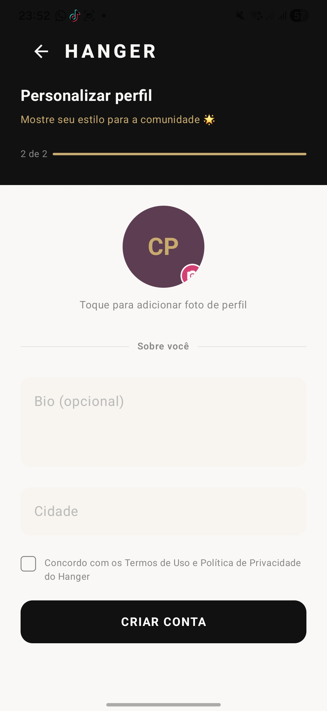

# Hanger — Documentação Técnica

> Rede social mobile para descoberta e compartilhamento de *looks* com filtro de clima e estilo.


## 1. Problema e Proposta

### Dor
Quando você quer escolher um look para uma ocasião específica e quer considerar o clima do dia, não existe um lugar que junte essas duas variáveis com inspirações reais de outras pessoas. Pinterest não tem contexto de clima; Instagram não tem filtro de ocasião.

### Solução
O **Hanger** é uma rede social mobile onde usuários publicam fotos dos seus looks tagueados com a temperatura do momento, a cidade e a categoria de ocasião (Casual, Formal, Esportivo, Festa etc.). Qualquer pessoa pode filtrar o feed por esses atributos e encontrar inspirações contextualizadas para o que está vivendo agora.

## 2. Identidade Visual

A identidade visual do projeto foi desenvolvida com uso de inteligência artificial com o objetivo de criar uma marca que comunique moda de forma autêntica sem cair na paleta pastel do universo feminino de moda.

### Logotipo

O símbolo central é um **cabide estilizado** que funciona de duas formas:
- Como **ícone standalone** do app (reconhecível em qualquer tamanho)
- Integrado ao **wordmark "HANGER"**, onde o "A" forma o gancho do cabide

Arquivo de identidade visual: [`hanger_brand_identity.svg`](hanger_brand_identity.svg)

### Paleta de Cores

| Token | Hex | Uso |
|---|---|---|
| Brand Pink | `#D63F72` | Cor primária — botões, ícones ativos, destaques |
| Plum | `#5C3D52` | Profundidade — gradientes, estados pressed |
| Onyx | `#111111` | Texto principal, headlines, editorial |
| Gold | `#C8A96E` | Destaques premium — taglines, badges especiais |
| Ivory / Cream | `#FAF8F6` | Background principal — nunca branco frio |
| Border | variante de Ivory | Divisores e bordas sutis |

A escolha do **Brand Pink** (`#D63F72`) como cor primária remete à energia e à moda sem ser um rosa doce. O **Ivory** como fundo evita o contraste agressivo do branco puro, dando à interface uma sensação de papel de revista de luxo acessível.

### Tipografia

| Peso | Uso |
|---|---|
| Helvetica Neue **800** (ExtraBold) | Wordmark, headlines de tela, nome do app |
| Helvetica Neue **400** (Regular) | Corpo de texto, labels, descrições |

O contraste entre os dois pesos cria hierarquia visual sem precisar de múltiplas famílias tipográficas.

### Tagline

> *"Vista sua história"*

Conecta o ato cotidiano de se vestir com narrativa pessoal, que é exatamente o que a rede social propõe: cada look publicado é um fragmento da identidade de quem o veste.

#### Protótipo Inicial

O protótipo inicial construído pelo Claude antes do desenvolvimento do app de fato está em [hanger_app_v4.html](./hanger_app_v4.html).

## 3. Tecnologias

### Mobile
| Tecnologia | Uso |
|---|---|
| **Kotlin** | Linguagem principal do app Android |
| **Jetpack Compose** | UI declarativa (Material 3) |
| **Retrofit 2.11** | Chamadas HTTP para o backend |
| **Gson** | Serialização/deserialização JSON |
| **Coil 2.7** | Carregamento de imagens assíncrono |
| **Coroutines + Flow** | Programação assíncrona e estados reativos |
| **ViewModel (MVVM)** | Separação de responsabilidades na UI |
| **FileProvider** | Compartilhamento seguro de arquivos de câmera |
| **NotificationCompat** | Notificações locais no Android |

### Backend
| Tecnologia | Uso |
|---|---|
| **.NET (C#)** | API REST principal |
| **PostgreSQL** | Banco de dados relacional |
| **GCP** | Hospedagem do backend |
| **Supabase Storage** | Bucket de imagens (posts e avatares) |

### API Externa
| API | Uso | Autenticação |
|---|---|---|
| **Open-Meteo** | Previsão do tempo (temperatura, umidade, vento, condição) | Pública — sem chave |

## 4. Arquitetura do App

O app segue o padrão **MVVM** (Model-View-ViewModel) com separação em camadas:

```
MainActivity (roteamento entre telas)
│
├── ui/screens/         ← Composables de cada tela
├── ui/components/      ← Componentes reutilizáveis (PostCard, BottomNav, WeatherBottomSheet...)
├── ui/theme/           ← Colors, Typography, Theme
├── viewmodels/         ← Estado e lógica de cada tela
├── data/
│   ├── models/         ← Data classes (PostDto, WeatherSnapshot, NotificationDto...)
│   └── repository/     ← Acesso a dados (PostsRepository, WeatherRepository...)
├── service/            ← Interfaces Retrofit (FeedService, WeatherService, AuthApiService)
├── client/             ← RetrofitClient (instâncias singleton)
└── notifications/      ← NotificationHelper, NotificationPollingService, UnreadCountViewModel
```

### Navegação
A navegação é gerenciada por uma `sealed class AppScreen` na `MainActivity`. Não usa `NavHost`: cada troca de tela é um `setState` em `mutableStateOf<AppScreen>`, mantendo o estado do usuário logado ao longo do ciclo de vida.

## 5. Telas

| Tela | Arquivo | Descrição |
|---|---|---|
| **Login** | `LoginScreen.kt` | Autenticação com email/senha |
| **Cadastro Step 1** | `RegisterScreen.kt` | Nome, username, email, senha |
| **Cadastro Step 2** | `RegisterScreen.kt` | Localização e preferências iniciais |
| **Feed** | `FeedScreen.kt` | Masonry grid com looks; filtros por categoria; integração clima |
| **Explorar** | `ExploreScreen.kt` | Busca por posts (título/tag) e por usuários |
| **Criar Post** | `CreatePostScreen.kt` | Upload de foto (câmera ou galeria), título, descrição, temperatura, categoria, tipo |
| **Detalhe do Post** | `PostDetailScreen.kt` | Imagem ampliada, curtidas, comentários, compartilhamento via Intent |
| **Perfil** | `ProfileScreen.kt` | Posts do usuário, contagem de seguidores, botão de logout |
| **Notificações** | `NotificationsScreen.kt` | Lista de curtidas, comentários e novos seguidores; marcação de lidas |

## 6. Banco de Dados

Banco relacional **PostgreSQL** hospedado via Supabase/GCP. Schema completo em [`../src/backend/script.sql`](../src/backend/script.sql).

### Diagrama de relações

```
users ──< posts ──< post_tags >── types >── categories
  │          │
  │< follows │< likes
  │          └< comments
  │          └< saved_posts
  └< notifications
  └< device_tokens
```

### Tabelas principais

**`users`** — Perfil do usuário (id, username, email, bio, avatar_url, location_city)

**`posts`** — Publicação de look. Campos relevantes:
- `weather_condition` — condição climática no momento do post (`sunny`, `rainy`, `cloudy` etc.)
- `temperature` — temperatura em °C
- `city` — cidade onde o post foi criado
- `share_count` — contador de compartilhamentos

**`categories`** — Categorias de estilo: Casual, Formal, Esportivo, Festa, Praia, Inverno, Streetwear

**`types`** — Subcategorias por estilo (ex: Casual → Básico, Minimalista, Colorido)

**`post_tags`** — Relação N:N entre posts e categorias/tipos

**`follows`** — Relações de seguidores (com constraint `no_self_follow`)

**`likes`** — Curtidas em posts

**`comments`** — Comentários em posts

**`notifications`** — Notificações de atividade (like, follow, comment, share). Enum: `notification_type`

**`device_tokens`** — Tokens FCM/APNs para push notifications futuras

**`saved_posts`** — Posts salvos pelo usuário

### Índices de performance

```sql
idx_posts_created_at      -- feed ordenado por data
idx_posts_user_id         -- posts por perfil
idx_notif_recipient_read  -- notificações não lidas
idx_post_tags_category    -- busca por categoria
idx_follows_following     -- contagem de seguidores
```

---

## 7. Rotas da API (Backend .NET)

| Método | Rota | Descrição |
|---|---|---|
| `POST` | `/auth/register` | Cadastro de usuário |
| `POST` | `/auth/login` | Login, retorna JWT |
| `POST` | `/auth/logout` | Invalida sessão |
| `DELETE` | `/auth/account` | Deleta conta |
| `GET` | `/users/{userId}` | Dados do usuário |
| `GET` | `/posts` | Todos os posts (feed) |
| `GET` | `/posts/user/{userId}` | Posts de um usuário |
| `POST` | `/posts` | Cria post (multipart/form-data) |
| `PUT` | `/posts/{id}` | Edita post |
| `DELETE` | `/posts/{id}` | Deleta post |
| `GET` | `/posts/search?q=` | Busca por título/tag |
| `POST` | `/posts/{id}/like` | Curtir post |
| `DELETE` | `/posts/{id}/like` | Descurtir post |
| `GET` | `/posts/{id}/likes/count` | Contagem de curtidas |
| `GET` | `/posts/{id}/comments` | Lista comentários |
| `POST` | `/posts/{id}/comments` | Adiciona comentário |
| `GET` | `/notifications/{userId}` | Lista notificações |
| `GET` | `/categories` | Lista categorias e tipos |

## 8. Integração com API de Clima (Open-Meteo)

A API **Open-Meteo** é pública, gratuita e não requer chave de autenticação.

**Endpoint utilizado:**
```
GET https://api.open-meteo.com/v1/forecast
  ?latitude={lat}
  &longitude={lon}
  &current=temperature_2m,relative_humidity_2m,wind_speed_10m,weather_code
  &hourly=temperature_2m,weather_code
  &timezone=auto
  &forecast_days=2
```

**Dados expostos na UI (WeatherBottomSheet no Feed):**
- Temperatura atual em °C
- Condição do tempo (ensolarado, nublado, chuva...) com emoji
- Umidade relativa do ar
- Velocidade do vento
- Sugestão de look baseada na temperatura
- Previsão para manhã / tarde / noite de hoje
- Temperatura de amanhã

**Fluxo:** `FeedScreen` → `WeatherViewModel` → `WeatherRepository` → `WeatherApiService` (Retrofit) → Open-Meteo

**Localização:** O dispositivo solicita permissão de GPS (`ACCESS_FINE_LOCATION`). A latitude/longitude são passadas diretamente ao Open-Meteo e nenhum dado de localização é salvo no backend sem consentimento do usuário.

## 9. Sistema de Notificações

O sistema de notificações funciona através de **polling ativo via Foreground Service**.

### Fluxo

```
Login → startForegroundService(NotificationPollingService)
  └── Coroutine (IO Dispatcher) — polling a cada 30s
        └── GET /notifications/{userId}?limit=50
              ├── 1ª execução: registra IDs já existentes (sem push)
              └── Execuções seguintes:
                    ├── Novas notificações → NotificationHelper.showNotification()
                    └── Broadcast (ACTION_UNREAD_COUNT) → UnreadCountViewModel → badge no ícone
```

### Componentes

| Arquivo | Responsabilidade |
|---|---|
| `NotificationPollingService.kt` | Foreground Service; loop de polling; broadcast de contagem |
| `NotificationHelper.kt` | Constrói e exibe a notificação local via `NotificationCompat` |
| `UnreadCountViewModel.kt` | Recebe broadcast; expõe `StateFlow<Int>` para os ícones da bottom nav |
| `NotificationsScreen.kt` | Lista de notificações; botão "marcar todas como lidas" |

### Tipos de notificação

| Tipo | Mensagem exibida |
|---|---|
| `like` | "@usuario curtiu sua publicação" |
| `comment` | "@usuario comentou na sua publicação «prévia»" |
| `follow` | "@usuario começou a seguir você" |

### Permissão
Em Android 13+ (API 33 / TIRAMISU), a `MainActivity` solicita `POST_NOTIFICATIONS` na inicialização.

## 10. Uso de Hardware do Dispositivo

### Câmera
Na tela **Criar Post**, o usuário pode escolher:
- **Tirar foto** — abre a câmera nativa via `ActivityResultContracts.TakePicture()`. A imagem é armazenada temporariamente via `FileProvider` em `cache/camera_images/` e enviada ao backend via multipart.
- **Escolher da galeria** — `ActivityResultContracts.PickVisualMedia()` (Photo Picker moderno do Android).

```kotlin
// Permissão de câmera solicitada via ActivityResultContracts.RequestPermission()
cameraPermissionLauncher.launch(Manifest.permission.CAMERA)
// URI seguro via FileProvider
FileProvider.getUriForFile(context, "${context.packageName}.fileprovider", file)
```

### GPS / Localização
Utilizado pelo `WeatherViewModel` para obter latitude e longitude do dispositivo e consultar a Open-Meteo. Permissão: `ACCESS_FINE_LOCATION`.

## 11. Compartilhamento

Na tela **Detalhe do Post**, o botão de compartilhamento usa o **Android Share Intent nativo**:

```kotlin
val shareIntent = Intent(Intent.ACTION_SEND).apply {
    type = "text/plain"
    putExtra(Intent.EXTRA_TEXT, "Veja esse look no Hanger: ${post.title}\n${post.imageUrl}")
}
context.startActivity(Intent.createChooser(shareIntent, "Compartilhar via..."))
```

O sistema operacional abre a caixa de compartilhamento com todos os apps disponíveis (WhatsApp, Instagram, e-mail, etc.). O `share_count` do post é incrementado no backend a cada compartilhamento.

## 12. Tratamento de Erros e Carregamento

- **`ErrorBanner`** — componente reutilizável que exibe mensagens de erro em destaque no topo da tela
- **`CircularProgressIndicator`** — indicador de carregamento nas telas de feed, explorar e detalhe
- **Pull-to-refresh** — `PullToRefreshBox` no feed para atualizar manualmente
- **Estados do ViewModel** — cada ViewModel expõe `isLoading`, `error` e `data` via `StateFlow`; a UI reage a cada mudança
- **Falhas de rede** — capturadas com `runCatching {}` nos repositórios; mensagem de erro propagada ao ViewModel

## 13. Como Executar

### Pré-requisitos
- Android Studio Hedgehog ou superior
- JDK 11+
- .NET SDK 8+ (para o backend)
- Dispositivo físico ou emulador Android API 24+

### Backend
```bash
# Build
dotnet build src/backend/core/Hanger.Application/

# Run
dotnet run \
  --project src/backend/Presentation/Hanger.WebApi/Hanger.csproj \
  --urls http://localhost:5089
```

### Banco de dados
Execute o script em `src/backend/script.sql` num PostgreSQL limpo (Supabase ou local):
```bash
psql -U postgres -d hanger -f src/backend/script.sql
```

### App Android
1. Abra `src/app/` no Android Studio
2. Configure o endpoint do backend em `src/app/app/src/main/java/com/example/hanger/client/RetrofitClient.kt`
3. Clique em **Run** (Shift+F10) com um dispositivo conectado

## 14. Screenshots das Telas

| Feed | Explorar | Criar Post |
|---|---|---|
|  |  |  |

| Login | Cadastro | Perfil |
|---|---|---|
|  |  |  |

| Notificações | Clima | Personalizar Perfil |
|---|---|---|
|  |  |  |
